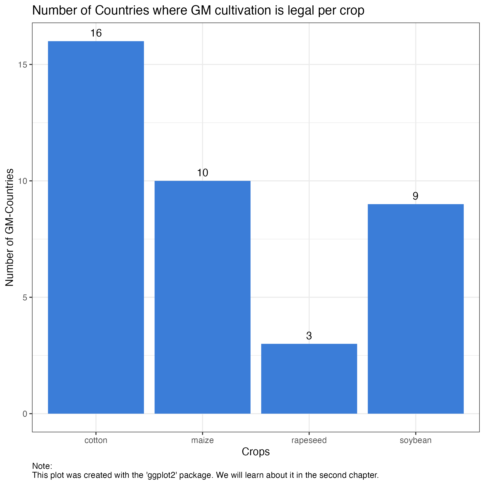
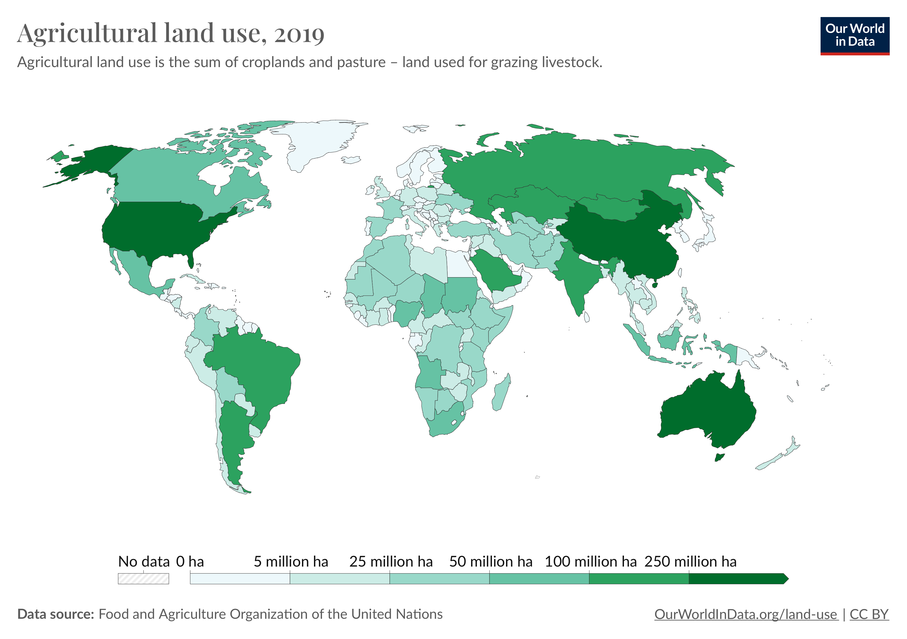
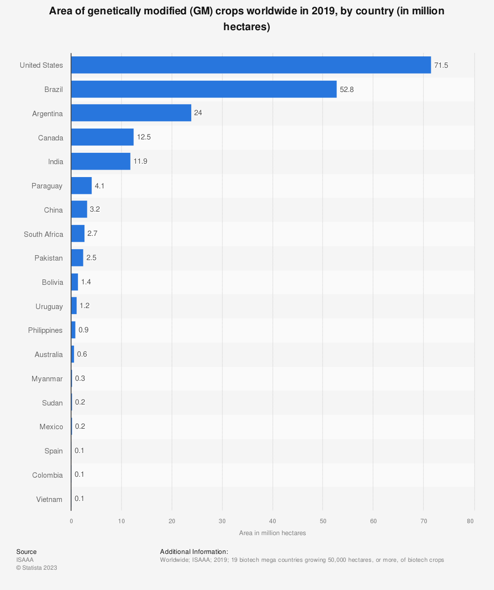

---
title: Problem Set Impacts-Genetically-Modified-Crops
output: 
  html_document: 
    keep_md: yes
    toc: yes
---

```{r setup, include=FALSE, echo=FALSE}
# Load libraries and source extra code
library(dplyr)
library(skimr)
library(ggplot2)
library(stargazer)
library(tidyr)
library(lfe)
library(RTutor)


# Options for rendering data frames
# If you knit to a Word docx file, try
# 
# data.frame.theme="word" 
# 
# (needs RStudio > 1.2.1)
# 
# You can also set the options like
# table.max.cols as chunk options
# Makes sense if there are too many, too wide
# columns in some chunks

RTutor::set.knit.print.opts(data.frame.theme="code", table.max.rows=25, table.max.cols=NULL, round.digits=5, signif.digits=8)


# continue knitting even if there is an error
knitr::opts_chunk$set(error = TRUE) 
```


## Impacts of genetically modified crops

Author: Daria Palitzsch

Welcome to my Problem Set that is part of my bachelor thesis at the University of Ulm. In the following analysis we exploit and discuss the National and Global Impacts of Genetically Modified (GM) Crops. The Problem Set is based on an empirical analysis in the paper [National and Global Impacts of Genetically Modified Crops](https://www.aeaweb.org/articles?id=10.1257/aeri.20220144) by Casper Worm Hansen and Asger Mose Wingender (2023). The data and stata code to this paper can be found [here](https://www.openicpsr.org/openicpsr/project/178041/version/V1/view).

**Note**: Please open all links in a new tab. This will prevent you from losing any progress in the problem set.

The Problem Set is published here:

* **GitHub**: <https://github.com/DariaPalitzsch/RTutorImpactsGMCrops>
* **ShinyApps**: <https://dariapalitzsch.shinyapps.io/RTutorImpactsGMCropsApp/>

We can look back at a long history of agriculture that started with the Neolithic Revolution between 10,000 and 5000 years ago all over the world. During this time, human societies started to settle and began farming. Until then, food was only received by hunting and gathering (Weisdorf, 2005, p. 561). Over the centuries, the farming skills were further developed. Advancements such as irrigation systems and crop rotation made farming increasingly profitable. The Industrial Revolution led to the introduction of mechanization and scientific breakthroughs that enhanced efficiency and increased the food production (O’Brien, 1977, p. 167). 

In the 1990s, genetic manipulation (GM) in agriculture was introduced commercially and set another milestone. From then on GM versions of a variety of crops were introduced in different countries. GM crops are defined as crop plants whose genetic makeup is altered through genetic engineering techniques. These modifications have the goal to enhance existing traits or introduce entirely new traits that do not naturally occur in the specific crop species. This includes, for example, better resistance to extreme weather or pests (Kumar et. al, 2020, p. 90). 
Over the past three decades, genetic manipulation has become increasingly important in the cultivation of crops. However, GM crops are still highly controversial and in many countries cultivation is not allowed (Quaim, 2009, p.667). 

The above-mentioned paper deals with the impact of genetically modified crops on economic factors such as yields, the area required for harvesting, and trade. These influences are investigated using a Triple Difference-in-Difference approach. 
In this problem set, we will focus on the influences on yields and examine the differences to conventional - non-GM - crops. Since the Triple Difference-in-Difference approach is a comparatively complicated statistical technique, we will approach it step by step. This problem set is therefore structured as follows: 
<br/>
In the first chapter we learn about the general structure of the underlying data and define the needed variables. Building on that, the second chapter is intended to give you a deeper insight into the topic. We start with visualizing the general development of yields for different crops. Moreover, we use a map to illustrate countries that are allowing GM cultivation. 
After that, we begin with the actual analysis. In the third chapter, we start with a first Difference-in-Difference estimation to estimate the impact of the legalization of genetic modification on cotton yields. This approach is extended in the fourth chapter and we additionally look at the differences between crops, namely cotton and rice. Since more than one type of crop is considered, this forms a Triple Difference-in-Difference approach. In the fifth chapter, we address the central specification, which is part of the underlying paper. It is an extension of the Triple Difference-in-Difference estimation in the fourth chapter. It no longer looks at the differences between two crops, but at the time trends of crucial crops. 
Finally, we recapitulate our results. 

**Note**: Chapter 1 to Chapter 4 are intended to bring us closer to the main specification and are my personal analyses. The main specification in Chapter 5 is mainly based on the analysis in the underlying paper. 

## Exercise Content 

1. Overview of the data

2. Descriptive Analysis

3. Initial Difference-in-Difference approach

4. Triple Difference-in-Difference approach

5. Main specification

6. Conclusion

7. References 

## Instructions for solving the Problem Set 

Throughout the Problem Set, you will encounter three different types of tasks: 

* Already solved code chunks allow you to simply `check` the chunk to run it. 
* Code chunks with placeholders `___` require you to fill in the missing code, such as missing variables or commands. 
* Quiz questions require you to choose the right answer.

To run a code chunk, press the `check` button. In some cases, you may need to click `edit` first. If you are unsure of the answer, you can click `hint` or directly press `solution` to view the correct output. 

Once you complete an exercise, proceed to the next page by clicking on `Go to next exercise...`.

<br/>

## Exercise 1 -- Overview of the data

In this chapter, our focus is on exploring the structure of the underlying data set and becoming familiar with the individual variables that are crucial for the subsequent analysis. 

Before we start, we first must read in the data set. It is stored in an RDS-file. We can use the command `readRDS()` to load the file named `data_crop.rds`. We store the file in the variable `data`. 

<b style="color:green">Task:</b> Just `check` the following code chunk to read in the data set. 

```{r "2_1"}
data <- readRDS("data_crop.rds")
```

Once we have loaded the data set, we aim to get to know its structure in more detail. In R, various functions are available for this purpose.
To gain an initial impression, the function `head()` is useful. By calling `head(data)`, we can display the first six rows of our data set.

<b style="color:green">Task:</b> Just `check` the following code.

```{r "2_2"}
head(data)
```
 
<br/>

As you can see, our data contains numerous variables, all of which will play a role in our following analyses. I have prepared the data set as the original one contained over 200 variables. For now, let's focus on the most essential ones. In R, we can use the so-called `dplyr` package for data manipulation tasks, such as picking specific variables. If you are not yet familiar with the package, I recommend checking the following info block.


***

### Info: dplyr
The `dplyr` package in R is a powerful and widely used tool for data manipulation. It provides a collection of functions designed for various manipulation tasks. The distinctive feature of this packages is the use of the `pipe` symbol, denoted as **%>%**. It is helpful when you want to perform multiple manipulations on one data set. With the help of the pipe, you can simply write them one after another, eliminating the need to repeatedly call the data set in each operation. 
**Example**: You can filter the data set `data` on the country "Germany" and store only the yields of it by simply calling:
```
data_filtered <- data %>%
  filter(country == "Germany") %>%
  select(yield)
```
The most important dplyr-commands are: 
* filter()
* select()
* mutate()
* arrange()
* group_by()
* summarize()

The last two commands are often used together to group by a variable (e.g. country) and then show statistics such as the mean of a certain variable per group afterwards.  
If you want to read more about the `dplyr`-package, have a look at the official documentation [here](https://www.rdocumentation.org/packages/dplyr/versions/1.0.10).

***


Before we use this package to succeed with our analysis, let´s engage in a short quiz: 


Quiz: What do you think which command fits best to show certain columns?

- filter() [ ]

- mutate() [ ]

- select() [x]

- arrange() [ ]


<br/>

For displaying certain columns of a data set, we use the `select()` command of the `dplyr`-package. In our case we want to keep the following variables: `year`, `yield`, `crop`, `country`, `GM_country`, `period`.

<b style="color:green">Task:</b> Load the necessary package by calling it in the command `library()`. Additionally, fill in the data set for which we want to show the `head()`.

```{r "2_3"}
# library(___)
# data_short <- data %>% 
#   select(c(year, yield, crop, country, GM_country, period)) 
# head(___)

#load the required package
library(dplyr)
#manipulate the data
data_short <- data %>% 
  select(c(year, yield, crop, country, GM_country, period)) 
#show head of data_short
head(data_short)
```

<br/>

The six columns provide an initial insight into the structure of our data. The data set records yields for a particular crop in a country for a specific year. The variable `GM_country` indicates whether a country has ever adopted any GM varieties. `period` divides the entire observation period in our data set into `pre` and `exp`. We will discover later why these variables are significant for our analysis.
Before delving into that, let us take a closer look at the two numeric variables, `year`and `yield`. The `summary()`  function is suitable for this task. 

<b style="color:green">Task:</b> Just `check` the following code chunk.

```{r "2_4",fig.width=12}
summary(data_short)
```

The `summary()` command provides us with some statistical information about our variables. The first two variables in our output (`year` and `yield`) are numeric, so we obtain ratios such as the mean, minimum, and maximum. The `year` variable indicates the year in which the corresponding yield was generated. The observation period extends from $1986$ to $2019$. Yields represent the average production in tons per hectare of harvested area in each country per year, ranging from $0.000$ to $135.9231$. Given that the mean value of $6.7639$ is close to the minimum, the maximum value might be an outlier.

Since the summary did not offer any information about the crops in our data set, we now aim to display a list of all crops. 
By using the `$` we can refer to a specific column in our data set. If we were to show the column crop directly, we would obtain all $70,000$ observations with many duplicates, as the same crops are harvested in different countries and years. To avoid this, the command `unique()` is suitable. It eliminates duplicates and shows a list of all distinct crops.

<b style="color:green">Task:</b> Replace the `___`  with the required column.

```{r "2_5"}
# unique(data$___)

unique(data$crop)
```

As you can see, the data set contains a diverse range of crops. Many of them represent only a small proportion of the world's cropland or lack a GM version. For the main specification, our focus will be on the most crucial crops for which a genetically modified version became commercially available during the observation period. These key crops are cotton, soybean, maize, and rapeseed. They are representing the most extensively cultivated GM crops worldwide. In 2019, they accounted for 99% of all genetically modified crop cultivation. The largest share is attributable to soybeans, accounting for 48% (see in [ISAA Brief 55-2019: Executive Summary](https://www.isaaa.org/resources/publications/briefs/55/executivesummary/default.asp)).

Another noteworthy aspect is the proportion of GM varieties within each crop. We observe substantial shares for soybeans and cotton, where approximately 75% of the global planted area was cultivated with a GM version of the respective crop in 2018. In contrast, for maize and rapeseed, the GM share was around 30% (see in [ISAA Brief 54: Global status of commercialized biotech/GM crops in 2018. (p.74)](https://www.isaaa.org/resources/publications/briefs/54/download/isaaa-brief-54-2018.pdf)).

If you are interested in the number and names of countries where a GM version of the essential crops is harvested, refer to the info block below. 

**Note**: This information is not relevant for our further analyses. 


***

### Info: Crucial Crops

<br/>

<br/>

<br/>

The plot illustrates the number of countries where GM cultivation is legal for each crop. 
GM cotton stands out as the most widespread, being cultivated in sixteen countries within our data set. 
GM rapeseed, on the other hand, is commercially grown in only three countries worldwide: Australia, Canada and in the United States. 
It is noteworthy that in the United States, all four crops have a GM version authorized for cultivation.
In Argentina, Brazil and Paraguay GM versions of cotton, maize and soybean have been legalized throughout the observation period. This suggests that South American countries may play a significant role in GM cultivation. We will revisit this aspect in the next chapter when we take a closer look at the GM-approving countries.  


***


**Summary** 

In this chapter, we gained an initial understanding of our data set and its variables. 
We examined the key variables and gained insights into yields. Additionally, we looked at the variety of crops within the data set.
In the following chapter, this basis is further developed, focusing on the development of the yields of the most crucial crops and examining the introduction of genetic manipulation of crops in different countries.

<br/>

## Exercise 2 -- Descriptive Analysis

In this chapter we will take a closer look at the yields of the four most important crops and become more familiar with the variable `GM_country` that indicates whether a country has ever adopted any GM varieties. 

As already mentioned in the last chapter, the four crucial crops are cotton, maize, soybean and rapeseed. Before we start with the analysis, we have to load the data set `data_crop.rds` again. 

<b style="color:green">Task:</b> Click `edit`and then `check` to read in the data set. 

```{r "3_6"}
data <- readRDS("data_crop.rds")
```

Next, we want to construct a data set named `data_mean` that contains the average yields for the crops `cotton`, `soybean`, `maize` and `rapeseed` per year. For this purpose, the `dplyr` package is suitable. We already learned about this package in the preceding chapter. 


Quiz: Which order of dplyr operations do we need to achieve the desired data set?

- filter() %>% group_by() %>% summarize() [x]

- select() %>% filter() %>% summarize() [ ]

- select() %>% mutate() %>% group_by() [ ]

- filter() %>% group_by() %>% arrange() [ ]


<br/>

We use `filter()` to select the rows that contain the needed crops. After that the data set is grouped by crop and year. With `summarize()` we get one yield per group by calculating the average yield. Additionally, we reorder the crops in the `levels()` command to prepare a nice legend for our plot. 

<b style="color:green">Task:</b> Just `check` the following code.

```{r "3_7"}
#load required package
library(dplyr)
#generate data set
data_mean <- data %>% 
  filter(crop %in% c("cotton", "soybean", "maize", "rapeseed")) %>% 
  group_by(crop, year) %>% 
  summarize(yield = mean(yield)) %>% 
  mutate(crop = factor(crop, levels = c("maize", "rapeseed", "soybean", "cotton")))
```

Now we have a data set that contains the average yields per crop over time. Note that we computed the average yield without distinguishing between GM and Non-GM harvests. 
We can use this data set to visualize the yields over time for the different crops. To do so, the package `ggplot2` is useful. It offers a wide range of functions to create nice graphics.


***

### Info: ggplot2
`ggplot2` is a very extensive and powerful package to display graphs in R. It is part of the `tidyverse` package. 
Plots are usually generated by starting with the command `ggplot()`. After that you are able to create plots by adding layers using `geom()` functions. 
Let´s illustrate this with an example: 
```
example_plot <- ggplot(data = data) +
  geom_line(aes(x=year, y=yield)) +
  ggtitle("Our first plot")
```
* Inside `aes()` the mapping of x and y is assigned. Additionally you can add other mappings like `color` depending on the `geom()` function it is used in. 
* The required data set can be assigned in the `ggplot()` command. However, it is also possible to assign the data in the corresponding `geom()` function if the layers require different data sets. 
* In addition, `ggplot2` has a wide range of other commands that allow, for example, the addition of titles, axis labels or personalized colors for groups. 
If you want to read more about this package, click [here](https://ggplot2.tidyverse.org) for further information.

***


Since we want to display a time course, we use `geom_line()`. In order to get one line per crop type, we have to use the argument `color` in the `aes()` of `geom_line()`. Additionally, we add the function `scale_color_manual()` to get nicer colors for our lines and add a title within the `ggtitle()` command. 

<b style="color:green">Task:</b> Just `check` the following code to display the graph.

```{r "3_8",fig.cap=''}
#load required package 
library(ggplot2)
#display plot
ggplot(data = data_mean) + 
  geom_line(aes(x=year, y=yield, color = crop)) + 
  scale_color_manual(values = c("#3b7dd8", "#84c1ff", "#009688", "#651e3e")) +
  ggtitle("Average yields over time")
```

<br/>

Take a look at the graph where the lines represent the four crucial crops for our later analyses. The graph depicts the average yields per year for each respective crop. The yield scale on the y-axis spans from $1$ to $4$ average tonnes per hectare. The observation period stretches from $1986$ to $2019$. Maize consistently generates the highest yields, starting at around $2.5$ and progressing to $4.5$ over the years, with the curve indicating a steep development.
Rapeseed also demonstrates an upward trend, but with a less steep curve. The rapeseed yields range from approximately $1.75$ to $2.5$.
Soybean and cotton have similar trends and are at lower levels compared to the others. Both crops show minimal growth, with yields hovering around $1.5$.

As previously mentioned, our crop graph does not differentiate between GM and Non-GM harvests. We now want to explore this distinction by examining the variable `GM_country`, which will be crucial for our subsequent analyses. This variable informs us about whether a country has ever adopted any GM varieties. `GM_country` is derived from the variable `GMdefacto`, which contains the year of the first commercial GM harvest in the respective country and is $0$ if the country has never adopted any GM variety. Therefore, the variable `GM_country` is equal to "GM-region" if `GMdefacto` contains a year for this country and "NonGM-region" otherwise. To visualize the countries, we can use a world map. The required coordinates are stored in the data set `data_map.rds`.

<b style="color:green">Task:</b> Just `check` the following code to load the data set and show the `head()` of it. 

```{r "3_9"}
#load data set
map <- readRDS("data_map.rds")
#show head
head(map)
```

<br/>

Our data set contains the latitudes and longitudes for each country that are required to display a map of the world. Moreover, the data set is categorized into two subsets based on the variable `GM_country`. The column `group` provides a unique identifier for contiguous areas within a country (e.g. if a country consisted of multiple islands), which is required to display national borders. 

To create the map, we again use the package `ggplot2`. In this case the command `geom_polygon()` is suitable. Inside the `aes()` we assign the correct variables to x and y. Additionally, we assign the variable `group` from our data set `map` to group and choose the right fill for our countries in the map. Similar to the preceding plot, the desired colors are applied using `scale_fill_manual()`. 

<b style="color:green">Task:</b> Fill in the right data set and choose the variable for the fill of the countries: 

```{r "3_10",fig.width=10, fig.cap=''}
# #show map
# ggplot(data = ___) + 
#   geom_polygon(aes(x = long, y = lat, group = group, fill = ___), colour="black") +
#   scale_fill_manual(values = c("#008080", "lightgrey")) +
#   ggtitle("GM cultivation worldwide")

#show map
ggplot(data = map) + 
  geom_polygon(aes(x = long, y = lat, group = group, fill = GM_country), colour="black") +
  scale_fill_manual(values = c("#008080", "lightgrey")) +
  ggtitle("GM cultivation worldwide")
```

<br/>

The map highlights GM-regions in green and reveals notable patterns in the legalization of GM crops. Across North and South America, the cultivation of GM crops has been legalized in nearly all countries. In opposite to that, no GM varieties have ever been harvested in European countries. One exception to that is Romania. Additionally, several African nations have allowed GM cultivation at some point, alongside major countries like India, China and Australia.
A significant concentration of GM variety production occurs in the United States, Brazil, Argentina, India, Canada and China. In 2014, 94% of the global production of GM varieties transpired there (Smyth, Kerr, & Phillips, 2015, p.25).

If you wish to explore background information on general agricultural land use and its comparison to land use for GM cultivation, please refer to the info block below.

**Note:** This information is not relevant for our further analyses.


***

### Info: Global agricultural land use

<br/>

<br/>

<br/>

The map illustrates the overall agricultural land use in 2019, measured in million hectares, without distinguishing between GM and Non-GM cultivation. Notably, the primary harvesting nations include the United States, China, and Australia, each having more than 250 million hectares of agricultural land. Following closely are Brazil, Argentina, Russia, Kazakhstan, Saudi Arabia, and India. Consequently, a significant portion of the largest producers is concentrated in North and South America, as well as Asia.

Our focus now shifts to identifying the leading countries in GM cultivation. The subsequent graph displays the GM crop areas in million hectares for the year 2019 per country. It's important to note that only countries with a minimum of 50,000 hectares of cultivated GM crops are represented in this graph.

<br/>

<br/>

<br/>

As you can see, the United States takes the lead in GM cultivation, covering 71.5 million hectares in 2019. When combined with Brazil, Argentina, and Canada, these nations contribute significantly to global GM production. This means that most of GM crops are harvested in North and South America. Besides that, India also plays a crucial role in this context. 

When we align these findings with the map shown before, it becomes apparent that the United States, Brazil, Argentina, and India are crucial players in both overall agricultural land use and GM cultivation. Canada, with an overall agricultural land of about 60 million hectares, allocates approximately 20% of it to GM cultivation. Notably, despite China's extensive agricultural land exceeding 250 million hectares, only 3.2 million hectares are designated for GM cultivation.


***


**Summary** 

In the previous exercises, we have illustrated the trends of maize, rapeseed, soybean and cotton over time. 
Additionally, we visualized the distribution of GM regions globally through a map. With the help of this knowledge, we can now return to our central question: What are the actual alterations in yields for specific crops resulting from the implementation of genetic manipulation?

<br/>

## Exercise 3 -- Initial Difference-in-Difference approach

In the preceding chapters, we mainly gathered background knowledge essential for understanding the data set and the analysis presented in the underlying paper. In the following chapters, our goal is to gain a better understanding of the actual methodology employed in the paper: a Triple Difference-in-Difference (DiD) approach to assess the impacts of cultivating GM crops.
In this section, we will introduce an initial DiD approach that compares the yields before and after the introduction of genetic manipulation in crops, differentiating between GM and Non-GM regions. This lays the groundwork for our subsequent analyses. 
We start with a graphical analysis, followed by a manual calculation of the DiD estimator. Subsequently, we compute this estimator using a linear regression, with extensions incorporating fixed effects and cluster-robust standard errors. 

Before we start with our analyses, we have to load the data set again.

<b style="color:green">Task:</b> Just `check` the following code. 

```{r "4_11"}
data <- readRDS("data_crop.rds")
```

As we have learned in the previous chapters, the underlying paper focuses on four crucial crops. In our introduction of the DiD approach we limit our analysis to the crop type `cotton`.
In `data` we still have all crops. Therefore we continue with filtering the data set. To do so, we again use the `filter()` command from the `dplyr` package.

<b style="color:green">Task:</b> Just `check` the following code to store the resulting data set in `data_cotton`. 

```{r "4_12"}
#load required package
library(dplyr)
#manipulate data set 
data_cotton <- data %>% 
  filter(crop == "cotton")
```

The Difference-in-Difference (DiD) approach is a statistical method to estimate the causal effect of a treatment. 
This is achieved by computing how the difference between the treatment and control group has changed in the experimental period in comparison to the pre-experimental period (Angrist & Pischke, 2008, p. 169). 

In our case the treatment means the legalization of the cultivation of GM crops. This divides our data set in two groups that are defined as follows: 

* Treatment group: Countries that allow the cultivation of GM crops
* Control group: Countries that do not allow the cultivation of GM crops

As we already examined in the last chapter, we can distinguish between the two groups by looking at the variable `GM_country` in our data set.

Furthermore, we observe two time periods, which result from the first commercial introduction of genetically modified crops in 1996. 

* Pre-experimental period: 1980 until 1995
* Experimental period: 1996 until 2019

The observations are divided into these two groups by the variable `period`.

Before we dive into the topic, we need to compute the average yields per year and group. For that purpose we derive a new data set from `data_cotton`. 


Quiz: For which variables should we group our data set `data_cotton` to get the desired average yields?

- year and country. [ ]

- year and GM_country. [x]

- year and crop. [ ]


<br/>

You are right. We need to group our data set by `year` and `GM_country`. To accomplish this, we use the `group_by()` command from the `dplyr` package. Subsequently, within the `summarise()` function, we calculate the average yields using the `mean()` function. 

<b style="color:green">Task:</b> Just `check` the following code chunk to compute the average cotton yields per year and group. 

```{r "4_13"}
data_mean <- data_cotton %>% 
  group_by(year, GM_country) %>% 
  summarise(yield = mean(yield)) 
```

Now we have a data set `data_mean` containing average yields per treatment and control group over the years. 
To illustrate the difference between the treatment and control group over time, we start with a graph using the `ggplot2` package. 
The graph features two lines representing the average yields in GM countries (treatment group) and Non-GM countries (control group). We add a vertical line to highlight the year when GM crops became commercially available (1996). This line divides the time course into the pre-experimental period and the experimental period. 

<b style="color:green">Task:</b> Replace the `___` with the name of the variables that we want to display on the x-axis.

```{r "4_14",fig.cap=''}
# #load required package
# library(ggplot2)
# #generate plot
# cotton_plot <- ggplot() +
#   geom_line(aes(x= ___, y=yield, color=GM_country), data = data_mean) +
#   geom_vline(xintercept = 1996, linetype = "dotted", color = "red") +
#   scale_color_manual(values=c("#33D4FF", "black")) +
#   ggtitle("Average cotton yields over time")
# #show cotton_plot
# cotton_plot

#load required package
library(ggplot2)
#generate plot
cotton_plot <- ggplot() +
  #add the lines per group over time
  geom_line(aes(x= year, y=yield, color=GM_country), data = data_mean) +
  #add vertical red dotted line for the year 1996
  geom_vline(xintercept = 1996, linetype = "dotted", color = "red") +
  #change colors manually
  scale_color_manual(values=c("#33D4FF", "black")) +
  ggtitle("Average cotton yields over time")
#show cotton_plot
cotton_plot
```

<br/>

The graph displays distinct lines for each group. The blue line represents countries that have legalized the cultivation of GM crops, while the black line corresponds to the control group where the genetic manipulation of crops is prohibited. 
The pre-experimental and the experimental period are visualized by a red dotted vertical line. 
Notably, the yields in the pre-experimental phase are similar in both groups, even if there are more variations in the treatment group. This may be due to less observations in the treatment than in the control group. In the experimental period the curves for both groups significantly drift apart. After the legalization of GM crops in 1996, the control group`s curve remains relatively flat, whereas the treatment group's curve exhibits a discernible increase. 

This graph provides an initial overview of the contrast between the two groups, especially after the introduction of GM crops in the treatment group. However, deriving a precise effect of the treatment is challenging. A more precise estimation can be obtained by employing the following formula for the DiD estimator:  

$${DiD} = (\overline{y}_{exp,gm} - \overline{y}_{exp,nongm}) - (\overline{y}_{pre,gm} - \overline{y}_{pre,nongm})$$

where $\overline{y}$ stands for the average yield in the corresponding group: 

* $\overline{y}_{exp,gm}$: treatment group during the experimental period
* $\overline{y}_{exp,nongm}$: control group during the experimental period
* $\overline{y}_{pre,gm}$: treatment group during the pre-experimental period
* $\overline{y}_{pre,nongm}$: control group during the pre-experimental period

Utilizing `dplyr`, the required values can be easily computed. Initially, we group our data set by `period` and `GM_country`. Subsequently, we compute the average yield per group and round it to two decimal places. 

<b style="color:green">Task:</b> `Check` the following code chunk to show the average yields per `period` and `GM_country`.

```{r "4_15"}
data_cotton %>%
  group_by(period, GM_country) %>% 
  summarize(yield = round(mean(yield),2))
```

<br/>

As you can see, we have four values, corresponding to each combination of `period` and `GM_country`. We compare the difference between the two groups within the same period. For instance, we take the first two `yield` values from the table and calculate the difference between GM and Non-GM regions for the experimental period. We repeat this procedure for the third and fourth values, comparing the average yields in the pre-experimental period for both groups. Subtracting the two differences produces the DiD estimator. 

<b style="color:green">Task:</b> `Check` the following code chunk to compute and show the DiD estimator for cotton.

```{r "4_16"}
#calculate the estimate
DiD_cotton = (1.89 - 1.44) - (1.35 - 1.36)
#show the Estimate
DiD_cotton
```

The DiD estimate is $0.46$. In general, the interpretation of the DiD estimator is as follows: The DiD estimator captures the change in the treatment group compared to the control group after the introduction of the treatment. Reconsider the formula and think about how we could specify this interpretation for our estimate. 


Quiz: Which interpretation of our estimate $0.46$ is correct?

- The cultivation of cotton in GM regions in the experimental period increases the average yields of cotton by 0.46 tonnes/hectare compared to the pre-experimental period. [ ]

- The cultivation of cotton in GM regions increases the average yields of cotton by 0.46 tonnes/hectare compared to Non-GM regions. [x]

- The cultivation of cotton in GM and Non-GM regions increases the average yields of cotton by 0.46 tonnes/hectare compared to a world where GM cultivation is banned everywhere. [ ]


<br/>

The estimate implicates that cultivating in a GM region increases the average yields of cotton by $0.46$ tonnes/hectare compared to Non-GM regions. 

Now that we have gained a initial understanding of the DiD approach , we can proceed to estimate the impact of cultivation in GM regions using a regression model. Compared to the previous manual calculation with a simple formula, this method offers two significant advantages: Firstly, running a regression in R allows us to observe standard errors, providing insights into the model's significance. Secondly, it enables you to add extensions to the model, such as fixed effects.

If you are unfamiliar with OLS estimation, please refer to the information block below.


***

### Info: Introduction to OLS
The Ordinary Least Squares method is used to estimate parameters in a linear regression. The model depicts a linear relationship between the dependent variable $y$ and at least one independent variable $x$. The basic form of a linear regression model is represented as $y_t = ß_0 + ß_1 x_{1,t}+u_t$ where $y_t$ and $x_{1,t}$ are observable variables. 
The error term $u_t$ is unobserved. The goal of OLS is to find the values for coefficients of the independent variables that minimize the sum of the squared residuals. This means it tries to minimize differences between the observations and the predictions of the model.
The predicted values $\hat{y}_{t}$ of $y_t$ given the estimates $\hat{ß_0}$ and $\hat{ß_1}$ can be calculated as $\hat{y_t} = \hat{ß_0} + \hat{ß_1} x_{1,t}$  (Verbeek, 2004).

***


In the following linear regression formula the OLS (ordinary least squares) estimator $\hat{ß}_{1}$ of ${ß}_{1}$ represents the DiD estimator: 

$$yield_{i,t} = ß_{0} + ß_{1} \cdot GM_{i} \cdot exp_{t} + ß_{2} \cdot GM_{i} + ß_{3} \cdot exp_{t} + u_{i,t}$$
where 

* $i$ indexes the individual countries 
* $t$ indicates the time 
* $yield_{i,t}$ is the dependent variable
* $GM_{i}$ is a dummy variable that is $1$ for the treatment group and $0$ for the countries in the control group
* $exp_{t}$ is a dummy variable that is $1$ if the respective observation is in the experimental period after 1996 and $0$ otherwise
* $u_{i,t}$ is the error term for a country $i$ at time $t$

In summary, we require three independent variables for our regression. On the one hand the already mentioned variables `exp` and `GM` and on the other hand the interaction term between these two variables. 

For a simple linear regression in R we use the `lm()` command. The needed interaction term of `exp` and `GM` is stored in the variable `exp_GM`. The `=` in our formula needs to be replaced by a `~` and you must specify the data set by writing `, data = data_cotton` after the formula in our command.
To show a nice regression output we use the `stargazer()` command from the `stargazer` package.

<b style="color:green">Task:</b> `Check` the following code chunk to show the first regression output. 

```{r "4_17"}
#load required package
library(stargazer)
#calculate regression
reg1 <- lm(yield ~ exp_GM + exp + GM, data = data_cotton)
#show the regression
stargazer(reg1, type = "text", omit.stat=c("adj.rsq","ser","f"))
```

If you do not yet have any experience in understanding the output of `stargazer()`, have a look at the corresponding info block.


***

### Info: Stargazer

The package stargazer enables us to display well-formatted regression outputs. 
We see the estimated coefficients for all controlled variables in the regression, along with the estimated constant of the model. The standard error of each estimator is displayed below the respective coefficients in parentheses. A distinctive feature, from which the function derives its name, is the inclusion of significance stars next to the estimators.
For instance, *** denotes significance at the 1% level, ** at the 5% level, and * at the 10% level, while no star indicates that an estimated coefficient is not significant at any relevant level. This information is also available in the "Note" section. In the upcoming sections of the problem set, additional lines will indicate the inclusion of fixed effects or cluster-robust standard errors. 
To learn more about individual adjustments, click [here](https://cran.r-project.org/web/packages/stargazer/vignettes/stargazer.pdf).


***


The stargazer output provides four estimates, with the estimators `exp_GM` and the constant in our regression proving highly significant at the 1% level. Conversely, the estimators `exp` and `GM` do not exhibit statistical significance.
In a regression analysis, the constant term, also known as the intercept, represents the value of the dependent variable when all independent variables are set to zero. Consider the implications of the variables `exp` and `GM` being $0$ as you respond to the upcoming question.


Quiz: What does the constant $ß_0$ with a value of $1.357$ stand for in our estimation?

- The average yield in the treatment group in the experimental period [ ]

- The average yield in the control group in the pre-experimental period [x]

- The average yield in the control group [ ]

- The average yield in the treatment group in the pre-experimental period [ ]


<br/>

$ß_0$ denotes the constant term in our regression analysis. When the variable `exp` is set to $0$, it signifies the pre-experimental period. Similarly, setting `GM` to $0$ places us in the control group. Consequently, $ß_0$ corresponds to the average yield during the pre-experimental period prior to 1996 in the control group, with the average yield standing at $1.357$ tonnes/hectare.

The estimate in the third row is `GM` with a value of $-0.007$. The interpretation of this estimate can be derived by setting all other variables in our regression to $0$. 

When $exp = 0$, we are looking at observations in the pre-experimental period. Consequently, the estimate of $-0.007$ indicates that the average yields in the pre-experimental period are $0.007$ tonnes/hectare lower in the treatment group compared to the control group. This indicates the same impression as we made in the graph that the average yields before the introduction of GM crops are very similar in both groups. 

## Fixed effects

Now we can proceed to enhance our initial regression model by introducing **fixed effects**, a methodology designed to help address issues related to unobserved differences among individuals or entities, such as countries. Fixed effects become particularly indispensable when considering variables like individual skills or, as in the underlying study´s context, the diverse economic and ecological circumstances across countries. However, not controlling for those impacts may result in biased estimates (Best & Wolf, 2015, p. 327).

An alternative approach to control for the treatment, which signifies whether a country permits the cultivation of GM crops, involves the inclusion of individual dummies for each country. This procedure is referred to as introducing **fixed effects** to our regression. 
Country fixed effects account for unobserved, time-invariant country-level heterogeneity. This means that we include differences between countries that are independent of the respective year. 

The initial formula for our DiD estimator can be changed as follows: 

$$yield_{i,t} = ß_{1} \cdot GM_{i} \cdot exp_{t} + ß_{2} \cdot exp_{t} + \delta_{i} + u_{i,t}$$
where $\delta_{i}$ denote the country fixed effects. 

To implement this formula, we would need to create a dummy variable for each country in our data set that is $1$ for each observation in the associated country and $0$ otherwise. Since the data set includes about 100 countries, creating dummy variables would be costly. In R we can avoid this problem by using the function `felm()` from the package `lfe`. It automatically creates dummy variables for every level of a variable. The basic structure of this function is as follows: 
**felm(response ~ dependent variables + control variables | fixed effects | 0 | cluster-robust standard error, data = data)**
For now, we do not have cluster-robust standard errors in our regression. So the country fixed effects are simply added by writing the variable `country` separated by `|` behind the formula in the `felm()`-function. Since we control for every level of the variable `country`, we do not longer have to control for `GM`.

<b style="color:green">Task:</b> `Check` the following code by to display our initial regression `reg1` alongside the current regression that includes country fixed effects.

```{r "4_18"}
#load required package
library(lfe)
#calculate the regression
reg2 <- felm(yield ~ exp_GM + exp | country, data = data_cotton)
#show the two regressions side by side
stargazer(reg1, reg2, type = "text", omit.stat=c("adj.rsq","ser","f"),
          add.lines=list(c("Country Fixed Effects?", "", "Yes")))
```

The initial column displays the standard regression without accounting for fixed effects. In the second column, we incorporated country fixed effects. Notably, we observe very similar estimates to those in the preceding regression. Both observed estimates in the second regression are highly significant.


Quiz: Which of our dependent variables is the DiD estimator?

- exp [ ]

- exp_GM [x]


<br/>

You are right. The interaction term `exp_GM` between `exp` and `GM` estimates the effect of how the cotton yields change after allowing the use of GM crops in certain countries compared to the control group where GM crops remained illegal. We estimated an increase in average cotton yields in GM regions by $0.456$ tonnes/hectare compared to Non-GM regions.

A noteworthy observation is that the standard error for our DiD estimator changes when we introduce country fixed effects. In comparison to the initial regression it decreases from $0.102$ to $0.042$.
In the second regression, we no longer observe a estimate for `GM` because we left out this control variable and added country fixed effects instead. Additionally, we no longer obtain a constant in our regression. 

In our second regression we addressed varying economic and ecological situations of the countries by adding country fixed effects. There are also other patterns and variations within our data set. Think about changes that are similar across countries. 


Quiz: For which variable should we add additional fixed effects to control for heterogeneity?

- period [ ]

- crop [ ]

- year [x]


<br/>

You are right. Since we only focus at one crop here, we do not have any variation in crops. However, we do account for changes that vary over the years, such as climatic conditions and input prices, through the inclusion of year fixed effects (Hansen & Wingender, 2023, p.225). 

This changes our regression formula as follows:

$$yield_{i,t} = ß_{1} \cdot GM_{i} \cdot exp_{t} + \delta_{i} + \lambda_{t} + u_{i,t}$$
where $\delta_{t}$ denote the country fixed effects and $\lambda_{t}$ denote the year fixed effects. 

To add year fixed effects to our regression, we remove the variable `exp` and add the variable `year` after the country fixed effects from the previous regression. In case you are wondering, why we can remove the control variable `exp` from our estimation, when we add fixed effects: We learned that including fixed effects simply means adding dummy variables for every level of a variable. Consequently, we can derive the year from these variables that tells us if an observation is in the pre-experimental or in the experimental period. 

<b style="color:green">Task:</b> `Check` the following chunk to integrate year fixed effects into our regression.

```{r "4_19"}
#calculate and show the regression
reg3 <- felm(yield ~ exp_GM | country + year, data = data_cotton)
#we can show all regressions side by side
stargazer(reg1, reg2, reg3, type = "text", omit.stat=c("adj.rsq","ser","f"),
          add.lines=list(c("Country Fixed Effects?", "", "Yes", "Yes"), c("Year Fixed Effects?", "", "", "Yes")))
```

With the inclusion of year fixed effects, we can now examine the stargazer output, which presents all three regressions. 

Quiz: Look at the regression output. What does change in the third column compared to the second?

- The DiD estimator. [ ]

- The significance level of the DiD estimator. [ ]

- The standard error of the DiD estimator. [ ]

- Nothing. [x]


<br/>

You are right. We still observe a DiD estimate of $0.456$ which remains highly significant compared to the second regression. Additionally, the inclusion of year fixed effects in the third column does not result in a change of the standard error of our DiD estimator `exp_GM`. 

Before we investigate whether classic standard errors are appropriate here, let us have a look at the underlying theory.

The standard error of an estimate in a simple regression is defined as follows (Grégoire (2014) p. 49 ff.): 

$$\widehat{SE}(\hat\beta_i)=\sqrt{s^2[(\mathbf{X}^T\mathbf{X})^{-1}]_{ii}}$$

 where 
 * $y = ß_0 + ß_1 x_1 + ...  + ß_i x_i + ... + ß_p x_p + \epsilon$ is the underlying regression
 * $SE(\hat\beta_i)$ is the standard error of the estimate $\hat\beta_i$
 * $s$ is the standard error of the regression
 * $X$ is the covariance matrix

The prerequisite for using standard errors is that the error terms are **independently and identically distributed** (iid). This implies that all error terms have the same probability distribution and are mutually independent. For that all error terms would have to be uncorrelated (Fahrmeir et al., 2022, p.2). The iid assumption is commonly violated in papers (Cameron & Miller, 2010, p.3).
Since we know that the error term in our regression includes all impacts that we do not control for in our regression, it is unlikely that this assumption is fulfilled in our estimation. As we are handling with individual countries it is probable that there are similarities in economical and ecological circumstances between neighboring countries such as common regulations and laws in the EU.

## Cluster-Robust Standard errors

For data where the iid assumption is not fulfilled, **cluster-robust standard errors** are employed, as they allow error terms to be correlated within clusters. In the context of DiD examples, cluster-robust standard errors tend to be larger than regular standard errors. This is attributed to a high correlation between the response variable $y$ and the errors within the clusters (Cameron & Miller, 2015, p.7).

In R we can display cluster-robust standard errors for the countries by adding them to our `felm()` command. 
To achieve this, we need to append `| 0 |` after the fixed effects, where the `0` serves as a placeholder. 
Following that, we introduce our cluster-robust standard errors by including the variable we wish to cluster, which, in our case, is `country`.

<b style="color:green">Task:</b> `Check` the following code to use cluster-robust standard errors in our fourth regression.

```{r "4_20"}
#calculate and show the regression
reg4 <- felm(yield ~ exp_GM | country + year | 0 | country, data = data_cotton)
#we can show all regressions side by side
stargazer(reg1, reg2, reg3, reg4, type = "text", 
          omit.stat=c("adj.rsq","ser","f"), 
          add.lines=list(c("Country Fixed Effects?", "", "Yes", "Yes", "Yes"), c("Year Fixed Effects?", "", "", "Yes", "Yes"), 
                         c("Cluster Robust Standard errors?", "", "", "", "Yes"))
          )
```

The resulting DiD estimator remains at $0.456$ and is still highly significant. 
As mentioned previously, it is typical for cluster-robust standard errors to surpass regular standard errors. This holds true in our case as well. The standard errors increase from $0.042$ to $0.160$.
Our final regression model incorporates country and year fixed effects along with cluster-robust standard errors. It suggests that the the cultivation in GM regions increases the average cotton yields by $0.456$ tonnes/hectare compared to Non-GM regions. 

## Summary and Discussion

In this chapter we introduced the DiD approach to examine the yield differences between GM-approving and GM-banning countries. The chapter began by illustrating the manual calculation of the treatment effect. Subsequently, we conducted a regression analysis. We included fixed effects and utilized cluster-robust standard errors. These steps intend to help isolating and assessing the impact of GM crops on crop yields.

However, it is important to acknowledge the limitations that were left out throughout this approach to focus on the initial intuition of the DiD estimation. Firstly, our analysis focused on a single crop, namely cotton. While this gives us a first insight into the DiD methodology, it does not capture the exact impact of GM crops on yields.

In this context, we should also reflect upon the interpretation of our estimates. The **treatment effect** examines the impact of the actual harvest of GM cotton on cotton yields. Given that the variables `GM` and `GM_country` only indicate if a country has ever adopted any GM varieties, all observations are included in the treatment group, regardless of whether GM cotton was actually harvested in the respective country and year. Consequently, our estimation does not precisely represent a treatment effect. It rather resembles an **intention-to-treat effect** (Hollis & Campbell, 1999, p. 673). To derive the treatment effect, it would be necessary to consider the actual year of GM legalization per country, which is stored in the variable `GMdefacto`. We will revisit this aspect later. 

Another limitation of our approach concerns the assumption of **parallel trends**, a prerequisite for the validity of the DiD approach. This assumption implies that in the absence of the treatment (GM crop adoption), the treatment and control group would follow similar trends over time. One can check if this assumption is violated by looking at the trends in the pre-experimental period (Wing, Simon, & Bello-Gomez, 2018, p. 457). Given that our main specification primarily focuses on linear trends rather than distinct periods, we opt not to explicitly specify this consideration in our approach.

<br/>

## Exercise 4 -- Triple Difference-in-Difference approach

In the last chapter we learned how to estimate the effect of a treatment using the DiD approach. We examined how the difference between the treatment and control group has changed in the experimental period in comparison to the pre-experimental period. 
Now we not only look at the differences in yields between different periods and countries, but also include the cultivation of different crop varieties. As we look at three 'differences', this approach is called the `Triple DiD approach`. 
Before we look at all four crucial crops in the next chapter, we keep it simple by only expanding our data set from the last chapter with the crop rice.

<b style="color:green">Task:</b> `Edit` and `check` the following code to read in our data set again.

```{r "5_21"}
data <- readRDS("data_crop.rds")
```

Analogously to the initial DiD approach in Chapter 3, we categorize two groups based on the variable `GM_country`:

* Treatment group: Countries permitting the cultivation of GM crops 
* Control group: Countries prohibiting the cultivation of GM crops 

Furthermore, we observe two time periods resulting from the first commercial introduction of GM crops in 1996, identifiable by the variable `period`:

* Pre-experimental period: 1980 until 1995
* Experimental period: 1996 until 2019

The Triple DiD approach expands upon this framework. Both the treatment and the control group are now subdivided into two groups. Consequently, each country in our data set can be divided into two groups (Olden & Moen, 2022, p. 534): 

* Group `cotton`: The group that can benefit from the treatment 
* Group `rice`: The group that cannot benefit from the treatment

The `rice` group cannot benefit from the treatment because we know that even in countries that have legalized GM cultivation, no GM rice is grown. The variable `GMdefacto` can be used to check whether there are no observations of GM rice cultivation in our data set. It indicates the year of the first commercial GM harvest of a crop. The value of `GMdefacto` is therefore always the same for each crop and country. If no GM cultivation of the crop has taken place, the variable has the value $0$. 
If there is no GM rice cultivation in our data set, `GMdefacto` must always be $0$. We can ensure this by filtering our data set by the crop `rice`. The command `distinct()` outputs the unique values of the variable that was selected.

<b style="color:green">Task:</b> Just `check` the following code.

```{r "5_22"}
#load required package
library(dplyr)
#show GMdefacto for rice
data %>% 
  filter(crop == "rice") %>% 
  distinct(GMdefacto)
```

<br/>

When we apply a filter for `rice` to our data set, we only observe the value $0$ for `GMdefacto`. Hence, the difference in yields between GM and Non-GM regions for `rice` cannot have their origin in using a genetically modified version of rice. 

We recommence with the manual calculation of the DiD estimator. To do so, we replicate the data set `data_cotton` from Chapter 3 by filtering for the crop `cotton`. 

<b style="color:green">Task:</b> Just `check` the following code chunk to generate `data_cotton`.

```{r "5_23"}
#recreate data_cotton
data_cotton <- data %>% 
  filter(crop == "cotton")
```

Analogously we compose a data set for rice that we store in the variable `data_rice`.

<b style="color:green">Task:</b> Fill in the `___` with the right `dplyr`-command to create the data set. 

```{r "5_24"}
# data_rice <- data %>% 
#   ___

data_rice <- data %>% 
  filter(crop == "rice")
```

Like in the last chapter, we now want to illustrate the average yields per treatment and control group over time with a graph. For that purpose we first have to compute the average yields. To simplify the presentation in a graph, we create `data_mean` data sets for each crop. 

<b style="color:green">Task:</b> Fill in the `___` with the right variables to create `data_mean_cotton`.

```{r "5_25"}
# data_mean_cotton <- data_cotton %>% 
#   group_by(___, ___) %>% 
#   summarise(yield = mean(yield))

data_mean_cotton <- data_cotton %>% 
  group_by(year, GM_country) %>% 
  summarise(yield = mean(yield))
```

Analogously to cotton, we create the same data set for rice. 

<b style="color:green">Task:</b> Just `check` the following code chunk. 

```{r "5_26"}
data_mean_rice <- data_rice %>% 
  group_by(year, GM_country) %>% 
  summarise(yield = mean(yield))
```

We now have two data sets for cotton and rice containing the average yields per group and year. Before we move on to the plot, let us do a little quiz.  


Quiz: Do we observe values in the treatment group for rice?

- Yes. [x]

- No. [ ]


<br/>

You are correct. The absence of GM cultivation for rice in our data set does not imply a lack of observations in the treatment group. There could still be instances of conventional rice cultivation in countries that allow GM cultivation.

To see the effect of `GM_country` on rice compared to cotton we use two `geom_line()` commands for each crop. In the case of rice, we designate a distinct linetype to facilitate differentiation between the two crops. Additionally, we add a vertical line to distinct between the pre-experimental and the experimental period. 

<b style="color:green">Task:</b> Just `check` the following code to display the graph.

```{r "5_27",fig.cap=''}
#load required package
library(ggplot2)
#display plot
ggplot() +
#geom_line() for cotton
geom_line(aes(x= year, y=yield, color=GM_country), data = data_mean_cotton) +
geom_vline(xintercept = 1996, linetype = "dotted", color = "red") +
scale_color_manual(values=c("blue", "black")) +
#geom_line() for rice 
geom_line(aes(x = year, y = yield, color = GM_country), linetype = 2, data = data_mean_rice) +
ggtitle("Average yields for cotton and rice over time")
```

The graph shows the progression of yields in the treatment group in blue, with the dashed lines representing the progression for rice. 
An initial observation shows that average rice yields exceed cotton yields. While the yields for rice range between $3$ and $5$ tonnes/hectare, the yields for cotton are relatively small and range from $1$ to $2.5$ tonnes/hectare. Another noteworthy insight is that the curves for rice appear parallel, with yields in the treatment group consistently higher throughout the entire observation period. 
Consequently, the **difference** between the average treatment and control group yields in both periods does not seem substantial. We observe no clear change in average yields in the treatment group after 1996. This aligns with our expectations, considering that we are aware of the absence of GM crop cultivation in both groups.

Before we turn to the calculation of the Triple DiD estimator we calculate the DiD estimator for rice. Like in the last chapter we group our data set by `period` and `GM_country` and calculate the mean yields per group with `summarise()`. 

<b style="color:green">Task:</b> Choose the right data set to calculate the required values for our DiD estimator.

```{r "5_28"}
# ___ %>%
#   group_by(period, GM_country) %>% 
#   summarise(yield = round(mean(yield),2))

data_rice %>%
  group_by(period, GM_country) %>% 
  summarise(yield = round(mean(yield), 2))
```

<br/>

If you do not remember the formula from the last chapter, take a look at the info box: 


***

### Info: manual DiD estimation
The formula for the DiD estimator is as follows:
$${DiD} = (\overline{y}_{exp,gm} - \overline{y}_{exp,nongm}) - (\overline{y}_{pre,gm} - \overline{y}_{pre,nongm})$$

where $\overline{y}$ stands for the average yield in the corresponding group: 

* $\overline{y}_{exp,gm}$: treatment group during the experimental period
* $\overline{y}_{exp,nongm}$: control group during the experimental period
* $\overline{y}_{pre,gm}$: treatment group during the pre-experimental period
* $\overline{y}_{pre,nongm}$: control group during the pre-experimental period

***


The procedure for the calculation of the DiD estimate is analogous to the calculation in the last chapter. 

<b style="color:green">Task:</b> Just `check` the following code chunk.

```{r "5_29"}
#calculate DiD_rice
DiD_rice = (4.39 - 3.54) - (3.60 - 2.98)
#show DiD_rice
DiD_rice
```

As it was already recognizable in our graph, the yields in GM countries are higher. We get a positive DiD estimate for rice of $0.23$. However, the positive effect of the GM region is smaller than for cotton, where we observed an estimator of $0.46$.

To continue with our analysis, we again need the DiD estimator for cotton from the last chapter. 

<b style="color:green">Task:</b> `Check` the following code to reproduce the Did estimator from the preceding chapter.

```{r "5_30"}
DiD_cotton = (1.89 - 1.44) - (1.35 - 1.36)
```

In these crop-specific calculations of `DiD_cotton` and `DiD_rice`, the differences between the treatment and control groups as well as the differences between the pre-experimental phase before 1996 and the experimental phase are taken into account. 

By now looking at two different types of crops, we add a third "difference" to our estimate. 
Thus, the formula of the Triple DiD estimate is as follows (Olden & Moen, 2022, p. 538):

$${DiD} = [(\overline{y}_{c,exp,gm} - \overline{y}_{c,exp,nongm}) - (\overline{y}_{c,pre,gm} - \overline{y}_{c,pre,nongm})] - [(\overline{y}_{r,exp,gm} - \overline{y}_{r,exp,nongm}) - (\overline{y}_{r,pre,gm} - \overline{y}_{r,pre,nongm})]$$

where $\overline{y}_{c}$ stands for the average yield for cotton and $\overline{y}_{r}$ for the average yield of rice. 
A closer look reveals that the formula can be simplified, with the first part being the DiD estimator for cotton and the second part being the DiD estimator for rice: 

$$DiD = DiD_{cotton} - DiD_{rice}$$
Since we already calculated the two required estimates, we can calculate the DiD estimate.

<b style="color:green">Task:</b> `Check` the following code to calculate and display the DiD estimate.

```{r "5_31"}
DiD = DiD_cotton - DiD_rice
DiD
```

The value of our Triple DiD estimation is $0.23$. Consequently, based on this outcome, we would anticipate an increase in yields of $0.23$ tonnes/hectare in GM regions compared to Non-GM regions. 

Analogous to the straightforward DiD approach we can calculate this estimate by conducting a regression analysis. However, before delving into the regression, we must construct a data set that contains cotton and rice crops. To do so, we filter the data set stored in `data` with the help of the `dplyr` package and subsequently save the newly created data set as `data_reg`.

<b style="color:green">Task:</b> Fill in the placeholder with the right `dplyr` command.

```{r "5_32"}
# data_reg <- data %>% 
#   ___(crop %in% c("cotton", "rice")) 

data_reg <- data %>% 
  filter(crop %in% c("cotton", "rice")) 
```

The regression formula in the last chapter did only cover cotton. Now that we have two different crops, we have to extend the formula by adding interaction within crops. To do so, we do not only extend the previous interaction term. We also add interaction between each two variables (Muralidharan & Prakash, 2017, p. 331): 

$$yield_{i,c,t} = ß_{0} + ß_{1} \cdot exp_{t} \cdot GM_{i} \cdot {crop\_cotton}_{c} + ß_{2} \cdot exp_{t} \cdot GM_{i} + ß_{3} \cdot GM_{i} \cdot {crop\_cotton}_{c} + ß_{4} \cdot exp_{t} \cdot {crop\_cotton}_{c} + ß_{5} \cdot exp_{t} + ß_{6} \cdot GM_{i} + ß_{7} \cdot {crop\_cotton}_{c} + u_{i,c,t}$$

where 

* $i$ indexes the individual countries 
* $t$ indicates the time 
* $c$ indicates the crop
* $yield_{i,c,t}$ is the dependent variable
* $GM_{i}$ is a dummy variable that is $1$ for the treatment group and $0$ for the countries in the control group
* $exp_{t}$ is a dummy variable that is $1$ if the respective observation is in the experimental period after 1996 and $0$ otherwise
* $crop\_cotton_{c}$ is a dummy variable that is $1$ if the respective observation is for cotton and $0$ otherwise 
* $u_{i,c,t}$ is the error term for a country $i$ for a crop $c$ at time $t$

The needed interaction terms are stored in the variables `exp_GM_crop`, `exp_GM`, `GM_crop` and `exp_crop`.


Quiz: The coefficient of which interaction term is the Triple DiD estimator?

- exp_GM_crop [x]

- exp_GM [ ]

- GM_crop [ ]

- exp_crop [ ]


<br/>

You are right. The coefficient of the interaction term `exp_GM_crop` estimates the Triple DiD estimator.

Since we already introduced country cluster-robust standard errors in the last chapter, we include them in all our following regressions. We start with a simple regression without considering fixed effects. Like in the preceding chapter we use the function `felm` from the package `lfe` for that purpose and display the output with the help of the function `stargazer`. 

<b style="color:green">Task:</b> Just `check` the following code chunk. 

```{r "5_33"}
#load required packages
library(lfe)
library(stargazer)
#calculate regression
reg_1 <- felm(yield ~ exp_GM_crop + exp_GM + GM_crop + exp_crop + exp + GM + crop_cotton | 0 | 0 | country, data = data_reg)
#show regression output
stargazer(reg_1, type = "text", omit.stat=c("adj.rsq","ser","f"),
          add.lines=list(c("Country cluster-robust standard errors?", "Yes")))
```

In the table you can see the `Constant` and seven further coefficients. 
The `Constant` of our regression is highly significant and denotes that the average yields for rice in the pre-experimental period in the control group were $2.977$ tonnes/hectare. 
Our primary focus lies on the coefficient of `exp_GM_crop`, representing the DiD estimate. The computed estimate is $0.227$. The estimate is not significant at any relevant level and we observe cluster-robust standard errors of $0.251$.

## Fixed effects

Analogously to the initial DiD approach in the last chapter, we extend our model by adding fixed effects. You can refresh your knowledge by reading the info block on this topic.


***

### Info: fixed effects
**Fixed effects** help to address issues related to unobserved differences between individuals or entities like countries. They become crucial when we consider factors like individual skills or - as in the underlying study - varying economic and ecological situations (Best & Wolf, 2015, p. 327 f.). 
To incorporate fixed effects for `year` in our regression, we would need to create a dummy variable for each year in our data set that is $1$ for each observation in the associated country and $0$ otherwise. Since the observation period in our data set stretches from 1986 to 2019, creating dummy variables would be costly. In R we can avoid this problem by using the function `felm()` from the package `lfe`. It automatically creates dummy variables for every level of a variable. The basic structure of this function is as follows: 
**felm(response ~ dependent variables + control variables | fixed effects | 0 | cluster-robust standard error, data = data)**

***


<br/>

Global crop yields are influenced by a range of external factors, including the overall economic situation and climatic conditions. These enduring influences, which exhibit relative stability over time, play a crucial role in shaping agricultural outcomes. 
To account for the impact of these persistent factors in our estimation, we incorporate fixed effects into our analysis. Fixed effects serve as a method to control for these unchanging factors and enhance the accuracy of our estimation.


Quiz: For which variable must fixed effects be added to control for such permanent influences?

- crop [ ]

- country [x]

- GM [ ]

- exp [ ]


<br/>

You are right. Permanent influences depend on the country in which the plants are harvested. Countries with extended droughts, for instance, may potentially have lower yields. We additionally consider volatile impacts such as variation in climate and input prices by including year fixed effects. 

The regression formula now looks as follows: 

$$yield_{i,c,t} = ß_{1} \cdot exp_{t} \cdot GM_{i} \cdot {crop\_cotton}_{c} + ß_{2} \cdot GM_{i} \cdot  exp_{t} + ß_{3} \cdot GM_{i} \cdot {crop\_cotton}_{c} + ß_{4} \cdot exp_{t} \cdot {crop\_cotton}_{c} + ß_{7} \cdot {crop\_cotton}_{c} + \lambda_{t} + \delta_{i} + u_{i,c,t}$$
where $\lambda_{t}$ denote the year fixed effects and $\delta_{i}$ denote the country fixed effects. 

<b style="color:green">Task:</b> Replace the `___` with the introduced fixed effects.

```{r "5_34"}
# #calculate regression
# reg_2 <- felm(yield ~ exp_GM_crop + exp_GM + GM_crop + exp_crop + crop_cotton | ___ + ___ | 0 | country, data = data_reg)
# #show regression output
# stargazer(reg_1, reg_2, type = "text", omit.stat=c("adj.rsq","ser","f"),
#           add.lines=list(c("Country cluster-robust standard errors?", "Yes", "Yes"), c("Country Fixed Effects?", "", "Yes"), c("Year Fixed Effects?", "", "Yes")))

#calculate regression
reg_2 <- felm(yield ~ exp_GM_crop + exp_GM + GM_crop + exp_crop + crop_cotton | country + year | 0 | country, data = data_reg)
#show regression output
stargazer(reg_1, reg_2, type = "text", omit.stat=c("adj.rsq","ser","f"),
          add.lines=list(c("Country cluster-robust standard errors?", "Yes", "Yes"), c("Country Fixed Effects?", "", "Yes"), c("Year Fixed Effects?", "", "Yes")))

```

The initial regression in the left column does not include fixed effects. The second column shows a regression incorporating both country and year fixed effects. When accounting for country and year fixed effects, the Triple DiD estimate is $0.226$. We still do not observe a significance at any relevant level and the cluster-robust standard errors remain at $0.251$. The coefficient for the dummy variable `crop_cotton` undergoes a change and shifts from $-1.620$ to $-1.542$. Additionally, we observe a slight increase in cluster-robust standard errors. The significance remains at the 1%-level. 

Similar to the previous chapter, the interpretation of the `crop_cotton` coefficient can be deduced by setting all other estimates to $0$:
* `exp` = $0$: pre-experimental period. This also means that all interaction terms that include `exp` are $0$.
* `GM` = $0$: Non-GM region. This also means that all interaction terms that include `GM` are $0$.

<br/>

Hence, the estimates implicate that during the pre-experimental period in Non-GM regions, the average yields for cotton are approximately $1.542$ tonnes/hectare lower than for rice. This interpretation aligns with our previous observation in the plot, where rice yields were generally much higher than those for cotton.

Within the Triple DiD approach, we introduced a third dimension of difference into our analysis. Consequently, we also encounter variation in yields between different crop types, precisely cotton and rice. To account for these crop-specific influences, we integrate crop fixed effects into our regression model. 

The regression formula now looks as follows: 

$$yield_{i,c,t} = ß_{1} \cdot exp_{t} \cdot GM_{i} \cdot {crop\_cotton}_{i, t} + ß_{2} \cdot GM_{i} \cdot  exp_{t} + ß_{3} \cdot GM_{i} \cdot {crop\_cotton}_{i, t} + ß_{4} \cdot exp_{t} \cdot {crop\_cotton}_{i,t} + \lambda_{t} + \delta_{i} + \gamma_{c} + u_{i,c,t}$$
where $\lambda_{t}$ denote the year fixed effects, $\delta_{i}$ denote the country fixed effects and $\gamma_{c}$ denote the crop fixed effects.

<b style="color:green">Task:</b> `Check` the following code chunk to implement crop fixed effects.

```{r "5_35"}
#calculate regression
reg_3 <- felm(yield ~ exp_GM_crop + exp_GM + GM_crop + exp_crop | country + year + crop | 0 | country, data = data_reg)
#show regression output
stargazer(reg_1, reg_2, reg_3, type = "text", omit.stat=c("adj.rsq","ser","f"),
          add.lines=list(c("Country cluster-robust standard errors?", "Yes", "Yes", "Yes"), c("Country Fixed Effects?", "", "Yes", "Yes"), c("Year Fixed Effects?", "", "Yes", "Yes"), c("Crop Fixed Effects?", "", "", "Yes")))
```

As we concluded our initial Triple DiD approach, we can now take a closer look at the results. In our Triple DiD regression we determine a treatment effect of $0.226$ tonnes/hectare. This result aligns with the outcome derived earlier in this chapter when we manually calculated the treatment effect. In essence, this finding means that harvesting cotton in a treated country results in an average yield increase of $0.226$ tonnes/hectare. 

Across all regression fits this effect remains consistent. Additionally, it is also noticeable that all estimators are not significant at any relevant level. We incorporated cluster-robust standard errors for `country` from the beginning and observe the same standard error for our DiD estimator of $0.251$ in every regression. 

In our previous regression analyses, we addressed unobserved differences by introducing individual fixed effects at the country, year and crop levels. Nevertheless, the Triple DiD estimation provides the flexibility to incorporate more refined fixed effects that account for variation within the above-mentioned fixed effects categories. For instance, we can introduce **crop-by-year fixed effects** that capture global trends relating factors such as technological improvements or changes that affect specific crops. 
By adding **country-by-year fixed effect** we control for changes in a specific country that are depending on the year. **Crop-by-country fixed effects** account for variations in the suitability of crops for different countries (Hansen & Wingender, 2023, p.225). 

This variation leads to a new regression formula: 

$$yield_{i,c,t} = ß_{1} \cdot exp_{t} \cdot GM_{i} \cdot {crop\_cotton}_{c} + \delta_{i,t} + \lambda_{c,t} + \gamma_{c,i} + u_{i,t}$$

where $\delta_{i,t}$ denote the country-by-year fixed effects and $\lambda_{c,t}$ denote the crop-by-year fixed effects and $\gamma_{c,i}$ denote the crop-by-country fixed effects.

<b style="color:green">Task:</b> `Check` the following code to incorporate country-by-year, crop-by-year and country-by-crop fixed effects in the regression. 

```{r "5_36"}
#calculate regression
reg_4 <- felm(yield ~ exp_GM_crop | country_yr + crop_yr + country_crop | 0 | country, data = data_reg)
#show regression output
stargazer(reg_1, reg_2, reg_3, reg_4, type = "text",
          omit.stat=c("adj.rsq","ser","f"),
          add.lines=list(c("Country cluster-robust standard errors?", "Yes", "Yes", "Yes", "Yes"), c("Country Fixed Effects?", "", "Yes", "Yes", ""), c("Year Fixed Effects?", "", "Yes", "Yes", ""), c("Crop Fixed Effects?", "", "", "Yes", ""), c("Country-by-year Fixed Effects?", "", "", "", "Yes"), c("Crop-by-year Fixed Effects?", "", "", "", "Yes"), c("Country-by-crop Fixed Effects?", "", "", "", "Yes")))
```

With the incorporation of refined fixed effects, our DiD estimate, denoted as `exp_GM_crop`, rises from $0.226$ to $0.367$. This means that our estimation implicates that the average cotton yields in the experimental period are $0.367$ tonnes/hectare higher in GM regions compared to cotton yields in Non-GM regions. 
Additionally, the standard errors increase from $0.251$ to $0.268$.

Before we proceed to the final model in the subsequent chapter, one further extension remains to be addressed.

## Cluster-robust standard errors

In our preceding regressions we incorporated country cluster-robust standard errors. The authors of the underlying paper go a step further by specifying cluster-robust standard errors on country-crop level in their approach.
As we learned in the previous chapter, cluster-robust standard errors allow error terms to be correlated within clusters. 

Compare `country` and `country-crop` cluster-robust standard errors when you answer the following question. 


Quiz: Which cluster-robust standard errors require a more stringent assumption regarding error terms?

- Country cluster-robust standard errors [ ]

- Country-crop cluster-robust standard errors [x]


<br/>

You are right. While introducing more nuanced fixed effects adds more flexibility to our model, it is important to note that cluster-robust standard errors on `country-crop` level are a more stringent assumption compared to the previously specified cluster-robust standard errors at the `country` level. While `country` cluster-robust standard errors allow error terms to be correlated within a country, `country-crop` cluster-robust standard errors do only allow correlation of error terms within a country for a specific crop (Bertrand, Duflo, & Mullain, 2004, p.250 f.). 
Nevertheless, we will include cluster-robust standard errors at the country-crop level in the upcoming main specification in order to replicate the authors' results.

<b style="color:green">Task:</b> Just `check` the following code chunk. 

```{r "5_37"}
#calculate regression
reg_5 <- felm(yield ~ exp_GM_crop | country_yr + crop_yr + country_crop | 0 | country_crop, data = data_reg)
#show regression output
stargazer(reg_1, reg_2, reg_3, reg_4, reg_5, type = "text",
          omit.stat=c("adj.rsq","ser","f"),
          add.lines=list(c("Country cluster-robust standard errors?", "Yes", "Yes", "Yes", "Yes", ""), c("Country Fixed Effects?", "", "Yes", "Yes", "", ""), c("Year Fixed Effects?", "", "Yes", "Yes", "", ""), c("Crop Fixed Effects?", "", "", "Yes", "", ""), c("Country-by-year Fixed Effects?", "", "", "", "Yes", "Yes"), c("Crop-by-year Fixed Effects?", "", "", "", "Yes", "Yes"), c("Country-by-crop Fixed Effects?", "", "", "", "Yes", "Yes"), c("Country-crop cluster-robust standard errors?", "", "", "", "", "Yes")))
```

In the final regression of this chapter we incorporated country-by-year, crop-by-year and country-by-crop fixed effects. Additionally, we clustered the standard errors on the country-crop level. Like in the previous regression we observe a DiD estimate of $0.367$. The standard error decreases from $0.268$ to $0.189$. This value is comparatively low. Additionally, we now observe a significance of our Triple DiD estimate at the 10%-level. 

## Summary

In this chapter, we expanded upon the initial DiD framework presented in the third chapter. Employing the Triple DiD approach, we delved deeper into our analysis, considering variations not only between pre-experimental and experimental periods and between treatment and control groups but also incorporating distinctions between different crops. Due to the complexity of this approach, our focus was narrowed to the estimation of two crops - cotton and rice.

Additionally, we enhanced the DiD approach by introducing more refined fixed effects and cluster-robust standard errors, resulting in an increase in our DiD estimate from $0.226$ to $0.367$.

It is noteworthy that, similar to Chapter 3, our estimation still does not precisely capture a treatment effect. We have yet to consider that a GM region does not necessarily imply the cultivation of GM cotton. Addressing this concern, the next chapter will explore event windows. 
Nevertheless, this chapter has provided valuable insights into the workings of the Triple DiD approach and introduced us to fixed effects and cluster-robust standard errors that we will need in the following chapter.

## Exercise 5 -- Main specification

In the last two chapters, we worked our way through the initial DiD approach to the Triple DiD approach, focusing on two crops due to the complexity of the analysis.
However, as highlighted in Chapter 1 and 2, there are four crucial crops. The methodology of calculating differences, as done in the previous chapter for cotton and rice, is not applicable if we want to estimate effects for all four crops in one regression. 
Instead of estimating yields based on the interaction of period, country and crop, we introduce variables for each specific crop. 
The variables are denoted as `GMtrendc_cotton`, `GMtrendc_soybean`, `GMtrendc_maize` and `GMtrendc_rapeseed`.
The four variables are all derived from the variable `GMtrend` that contains the number of successive GM harvests up until, and including, the current year. The variable `GMtrend` is based on the following variables:

* `GMdefacto`: This variable contains the year of the actual legalization of GM cultivation of a crop in a country and is $0$ otherwise.
* `GMwithdrawn`: This variable contains the year of abolition of GM cultivation of a crop in a country and is NA otherwise.

This extension addresses a significant limitation in our previous analyses. Prior to this enhancement, we could not definitively determine whether a crop in a country in the treatment group was effectively treated in a specific year. The introduction of the `GMtrend` variable for each crop enables us to precisely identify the period of treatment for each country and crop. 

<b style="color:green">Task:</b> Just `check` the following code to load the data set once again. 

```{r "6_38"}
data <- readRDS("data_crop.rds")
```

Let us start our analysis by examining the crop specific variables of `GMtrend`. To demonstrate how these variables are computed, we display the variables `GMtrendc_cotton`, `GMdefacto`, `GMwithdrawn` along with their corresponding years. Since the value of `GMdefacto` depends on the specific country, we only present observations in the country Brazil. Additionally, we filter the observations to include only cases where `GMtrendc_cotton` is not equal to $0$. 

<b style="color:green">Task:</b> `Check` the code chunk to display the desired output. 

```{r "6_39"}
#load required package
library(dplyr)
#display desired output
GM_data <- data %>% 
  filter(GMtrendc_cotton != 0 & country == "Brazil") %>% 
  select(GMtrendc_cotton, GMdefacto, GMwithdrawn, year, country)
head(GM_data)
```

The variable `GMtrendc_cotton` quantifies the number of successive GM harvests of cotton up until, and including, the current year. 
In our output, we see that the variable is computed by subtracting the year of actual GM cultivation legalization in a country (`GMdefacto`) from the current year. In our case the year of actual GM cultivation for Brazil is $2007$. In the unusual case that `GMwithdrawn` is not $NA$, the variable `GMtrendc_cotton` would be calculated by subtracting `GMdefacto` from `GMwithdrawn`. 
If the year in the current observation is earlier than `GMdefacto` in that country, the value of `GMtrendc_cotton` would be $0$. 

With the introduction of crop-specific variables that consider the actual legalization of GM crops, we now have varying treatment periods for countries. Consequently, we can no longer divide our observation period into a pre-experimental and an experimental period, as done in the previous chapters. 

The authors of the underlying paper define the variable `GMdefacto` as the event year. Building upon this, we derive the variable `relative_yr`, representing the temporal gap until the first unrestricted harvest of GM varieties for a given crop. Negative values indicate that the current year precedes the first unrestricted harvest. This variable is based on whether the year under examination is prior to or after the commercial introduction of GM crop varieties in a specific country. 

Let us illustrate the computation of `relative_yr`. To do this, we generate a subset of the data that includes only the country Brazil and the crop cotton. This selection is useful because Brazil has adopted GM cotton at a certain point. We select the relevant columns and arrange the data in ascending order by year to facilitate the interpretation of our results. 

<b style="color:green">Task:</b> `Check` the following code to show the `head()` of our created data frame. 

```{r "6_40"}
yr_data <- data %>% 
  filter(country == "Brazil" & crop == "cotton") %>% 
  select(GMdefacto, GMwithdrawn, year, relative_yr) %>% 
  arrange(year)
head(yr_data)
```

The head of `yr_data` provides insight into the first six years, from 1986 to 1991, for Brazil and cotton in our data set. Given that the authorization of this genetically modified (GM) variety in Brazil occurred in 2007, all `relative_yr` values are negative.

As illustrated, the variable `relative_yr` is calculated by subtracting `GMdefacto` from the current year. This variable enables us to define an event window around `GMdefacto` for each country and crop. The event window spans from ten years before the first legal cultivation of the corresponding GM variety to ten years after the first legal cultivation of the corresponding GM variety in a country.

<b style="color:green">Task:</b> Just `check` the following code to filter for `relative_yr`.

```{r "6_41"}
final_data <- data %>%
  filter(relative_yr <= 10 | is.na(relative_yr))
```


Quiz: Does this code generate the right event window?

- Yes. [ ]

- No. [x]


<br/>

You are right. The authors of the underlying analysis made a small mistake here. This code only restricts the data set `final_data` to all observations that were made a maximum of ten years after the introduction of a GM variety (`GMdefacto`) in a country. The original code of the authors, that was written with the statistical software "stata", looks as follows: 

```
*USE SHORT POST GM-WINDOW
drop if relative_yr>10 & relative_yr!=.
```

We can see that the restriction for ten years **before** the respective introduction is missing. The code does only drop NA values or observations ten years **after** the introduction of a GM variety in a country. 

Let us generate a second data set that generates the event window correctly.

<b style="color:green">Task:</b> Fill in the placeholder with the correct event window. 

```{r "6_42"}
#   correct_data <- data %>% 
#   filter((relative_yr <= 10 & relative_yr >= ___) | is.na(relative_yr))

correct_data <- data %>% 
  filter((relative_yr <= 10 & relative_yr >= -10) | is.na(relative_yr))
```

Before we show the authors' regression without the correct event window and our regression side by side, let us have a look at the regression formula. 
Like in our last regression in Chapter 4 we include `country_yr`, `crop_yr` and `country_crop` fixed effects and cluster our standard error on `country_crop`. 

The regression is defined as follows: 

$$ln(yield_{i,c,t}) = ß_1 \cdot {GMtrendc\_cotton}_{i,t} +  ß_2 \cdot {GMtrendc\_soybean}_{i,t} + ß_3 \cdot {GMtrendc\_maize}_{i,t} + ß_4 \cdot {GMtrendc\_rapeseed}_{i,t} + \delta_{i,t} + \lambda_{c,t} + \gamma_{c,i} + \epsilon_{i,c,t}$$
where 

* $ln(yield)_{i,c,t}$ is the natural logarithm of $yield$ 
* $\delta_{i,t}$ denote the country-by-year fixed effects
* $\lambda_{c,t}$ denote the crop-by-year fixed effects
* $\gamma_{c,i}$ denote the crop-by-country fixed effects
* $\epsilon_{i,c,t}$ is the error term.

Like in the preceding chapters the needed interaction terms are `country_yr`, `crop_yr` and `country_crop`.
Let us begin with the regression of the underlying paper by using the data set `final_data`. 
 
<b style="color:green">Task:</b> Just `check` the following chunk to store the regression in `reg1`.

```{r "6_43"}
#load required packages
library(lfe)
#estimate regression
reg1 <- felm(lnyield ~ GMtrendc_cotton + GMtrendc_soybean + GMtrendc_maize + GMtrendc_rapeseed | country_yr + crop_yr + country_crop | 0 | country_crop, data = final_data)
```

Analogously we compute the regression with the correct event window by using the data set `correct_data`. 

<b style="color:green">Task:</b> Just `check` the following chunk to store the regression in `reg2`.
 
```{r "6_44"}
#estimate regression
reg2 <- felm(lnyield ~ GMtrendc_cotton + GMtrendc_soybean + GMtrendc_maize + GMtrendc_rapeseed | country_yr + crop_yr + country_crop | 0 | country_crop, data = correct_data)
```

Now that we have computed both regressions, we can compare the outputs. 

<b style="color:green">Task:</b> Fill in the placeholder `___` to show both regressions side by side.

```{r "6_45"}
# #load required packages
# library(stargazer)
# #show regression output
# stargazer(___, ___, type = "text", omit.stat=c("adj.rsq","ser","f"),
#              column.labels = c("Authors", "Own"))

#load required packages
library(stargazer)
#show regression output
stargazer(reg1, reg2, type = "text", omit.stat=c("adj.rsq","ser","f"),
          column.labels = c("Authors", "Own"))
```

The table shows the two regressions side by side. The left side displays the regression from the original paper, while the right side shows our regression incorporating the adjusted event window. The standard errors are clustered on the country-crop level. 
Note that we regressed on `lnyield` instead of `yield`. Consequently, the interpretation of our estimate differs from the preceding chapters. To gain insights into interpreting logged dependent variables, refer to the information block provided below.


***

### Info: Logging the dependent variable
When the dependent variable is logged in a simple regression like $\hat{ln(y)} = \hat{ß_0} + \hat{ß_1} * x$, the general interpretation is as follows: 
"If x increases by one unit, our prediction of y increases by approximately 100 * $\hat{ß_1}$ percent.

***


The regressions allow us to explore the effects for each crop variety individually. Given our focus on cotton in the preceding chapters, we begin our examination by looking at the estimator for cotton in the third row. 

Notably, both regressions yield highly significant estimates. In both cases the standard errors and the estimates are similar, albeit the regression coefficient in the second column is slightly smaller. This discrepancy may imply that the larger event window in the first column included more observations in GM regions. Our regression estimates a significant effect, indicating a $4.3$ percent faster yearly yield increase in GM regions compared to Non-GM regions. Such a large effect appears plausible when we look at cotton yields in India. Historically, India had one of the lowest average cotton yields globally. However, the yields have increased by over 40% since 2002, where GM varieties of cotton were introduced there (Choudhary & Gaur, 2010, p.9 f.). 

The estimate of `GMtrendc_maize` undergoes changes when we adjust the event window. Specifically, the estimate decreases from $0.027$ to $0.018$. According to our regression results, the introduction of GM maize corresponds to a $1.8$ percent faster annual increase in maize yields within our ten-year estimation window, compared to untreated crops. 

Conversely, the observed effects for soybean and rapeseed are relatively small. 
For soybean, the yearly yield increase is $0.7$ percent faster per year in GM regions compared to Non-GM regions. The reason why there is no significant effect here could be due to the replacement of herbicides by genetically modified versions, resulting in similar yields in Non-GM regions (Bonnie, 2008, p. 26).
For rapeseed, there is a remarkable discrepancy between the two regressions. In the first regression, the estimator for `GMtrendc_rapeseed` is not significant at any level, with an estimated value of $0.004$. In the second regression, however, the estimator is $0.011$ and reaches significance at the 5%-level.

As previously discussed, the authors of the underlying paper do not explore various cluster-robust standard errors. Their chosen approach involves clustering at the country-crop level, which requires a rather stringent assumption, that the error terms are only correlated within a specific country for a specific crop.

Before we recapitulate our analyses, we want to assess the robustness of the authors´ estimation by substituting the country-crop cluster-robust standard errors with country cluster-robust standard errors, used in Chapter 3 and at the beginning of Chapter 4. Such **robustness checks** are quite common in empirical studies and analyses (Xun & White, 2013, p.294). 

**Note**: This specification is not part of the underlying paper!

<b style="color:green">Task:</b> Just `check` the following code chunk. 

```{r "6_46"}
#compute the regression with country cluster-robust standard errors
reg_country <- felm(lnyield ~ GMtrendc_cotton + GMtrendc_soybean + GMtrendc_maize + GMtrendc_rapeseed | country_yr + crop_yr + country_crop | 0 | country, data = final_data)
#show the authors´ regression alongside with the new one
stargazer(reg1, reg_country, type = "text", omit.stat=c("adj.rsq","ser","f"),
          column.labels = c("Authors", "Own"))
```

Have a closer look at the two regression output and answer the following quiz:


Quiz: What does change in the second column compared to the first regression?

- Standard errors [ ]

- Significance [ ]

- Estimates [ ]

- Nothing [x]


You are right. Our regression does not change when we cluster on country level. 

In both regressions we include country-year, crop-year and country-crop fixed effects. 
The first column represents the regression with country-crop cluster-robust standard errors. In the second regression we only cluster on country level. 

Interestingly, this modification has no impact on the results. The estimates, standard errors, and significance levels for all four crops remain identical. This implies that the more stringent assumption, where standard errors are allowed to be correlated only within a specific country for a specific crop, does not alter our estimation compared to country cluster-robust standard errors.

## Summary

In this chapter, we specified our main specification, following the approach of the underlying paper. Expanding the Triple DiD approach introduced in the fourth chapter, we maintained the incorporation of country-year, crop-year, and country-crop fixed effects, along with country-crop cluster-robust standard errors. The key modification was the utilization of `GMtrend_`-variables for each crop, namely cotton, soybean, maize, and rapeseed. This adjustment enabled us to identify the actual period of treatment for each crop, defining an event window spanning ten years before and after the introduction of the treatment. For the correct event window, we adapted the code from the authors of the underlying paper. 
We observed highly significant effects for cotton and maize. In contrast, the observed effects for soybean and rapeseed were relatively small and not significant at any relevant level. Adapting the authors' code led to an increase in the estimator and significance for rapeseed. Moreover, the estimation for maize increased after our adjustment of the event window.
Concluding our analysis, we conducted a robustness check by altering the cluster-robust standard errors from the country-crop to the crop level. Remarkably, our estimation remained consistent under this change.

<br/>

## Exercise 6 -- Conclusion

In this problem set we delved into the impacts of genetic manipulation on crop yields. We employed a Triple Difference-in-Difference approach to examine differences between conventional and GM crops. 
The initial two chapters established the groundwork by exploring the data set. In **Chapter 1** we explored the data set that provided the basis for all our further analyses. We examined the most crucial columns such as `year`, `yield`, `country` and `crop`. We looked at the wide range of crops in our data set and highlighted the four crucial crops cotton, soybean, maize and rapeseed. 
In **Chapter 2** we dived deeper into our data set and looked particularly at the `yield` development of the four crucial crops. Additionally, we gained insights into the GM cultivation worldwide. 

**Chapter 3** initiated the formal analysis, focusing on the effect of GM cultivation on cotton yields. We employed a DiD approach and the results indicated an average increase of $0.456$ tonnes/hectare after the introduction of GM cultivation. However, the simplicity of the approach overlooked nuances, such as GM region not explicitly implying GM cotton cultivation. 
Building on this, **Chapter 4** expanded our approach by incorporating rice, leading to a Triple DiD approach. We differentiated not only between periods and groups but also between crops. Since there is no GM rice in our data set, we knew that only cotton cultivation could benefit from the treatment in the treatment group. The refined approach estimated a $0.367$ tonnes/hectare increase in average yields compared to Non-GM regions. With including the differentiation between cotton and rice, we came closer to an actual treatment effect. However, GM region still did not implicate the actual cultivation of cotton there. 

**Chapter 5** adopted the main specification from the underlying paper, extending the analysis to include all four crucial crops cotton, soybean, maize and rapeseed. Compared to the preceding analyses we no longer looked at two periods, but included ten-year event windows around the GM introduction of each crop in each country. Additionally, we estimated logged yields and found significant effects for cotton, soybean, and rapeseed. For instance, cotton exhibited a $4.3$ percent faster yearly yield increase in GM regions compared to Non-GM regions.

In conclusion, the problem set provided valuable insights into the complex dynamic of genetic manipulation and its impact on crop yields. The step-by-step approach aimed to make the complex Triple Difference-in-Differences methodology more understandable and provide a nuanced understanding of the multiple assumptions and methodologies involved.

<br/>

## Exercise 7 -- References 

**Academic Papers and Books**

Angrist, J., Pischke, J.S. (2008). Mostly Harmless Econometrics: An Empiricist's Companion. _Princeton university press_. ISBN: 978-0-691-12035-5

Bertrand M., Duflo, E., Mullain, S. (2004). How much should we trust Differences-In-Differences estimates?. _The Quarterly journal of economics_, 119(1), 249-275

Best, H., Wolf, C. (2015). The Sage handbook of regression analysis and causal inference. _Sage Publications_. ISBN:978-1-4462-5244-4

Bonnie, S. (2008). Genetically modified glyphosate-tolerant soybean in the USA: adoption factors, impacts and prospects. A review. _Agronomy for Sustainable Development_, 28(1), 21-32

Cameron, C., Miller, D. (2010). Robust inference with clustered data. _Working Paper_, 10-7, University of California, Department of Economics, Davis, CA

Cameron, C., Miller, D. (2015). A Practitioner’s Guide to Cluster-Robust Inference. _Journal of Human Resources_, 50(2), 317-372

Choudhary, B., Gaur, K. (2010). Bt Cotton in India: A Country Profile. _ISAAA Series of Biotech Crop Profiles._ ISAAA: Ithaca, NY.

Fahrmeir, L. , Kneib, T., Lang, S., Marx, B. D. (2022). Regression. _Heidelberg: Springer Verlag_

Grégoire, G. (2014). Multiple Linear Regression. _EAS Publications Series_, 66, 45-72

Hansen, C. W., Wingender, A. M. (2023). National and Global Impacts of Genetically Modified Crops. _Insights_, 5(2), 224–240

Hollis, S., Campbell, F. (1999). What is meant by intention to treat analysis? Survey of published randomised controlled trials. _BMJ: British Medical Journal_, 319(7211), 670-674

Kumar, K., et al. (2020). Genetically modified crops: current status and future prospects. _Planta_, 251(4)1, 91

Muralidharan, K., Prakash, N. (2017). Cycling to School: Increasing Secondary School Enrollment for Girls in India. _American Economic Journal: Applied Economics_ , 9(3), 321–350

O’Brien, P. K. (1977). Agriculture and the Industrial Revolution. _The Economic History Review_, 30(1), 166–181

Olden, A., Moen, J. (2022). The triple difference estimator. _The Econometrics Journal_, 25(3), 531-553

Qaim, M. (2009). The Economics of Genetically Modified Crops. _Annual Review of Resource Economics_, 299(5608), 900-902

Smyth, S.,Kerr, W. A., Phillips, P. W. B. (2015). Global economic, environmental and health benefits from GM crop adoption. _Global Food Security_, 7, 24-29

Verbeek, M. (2004). A Guide to Modern Econometrics. _John Wiley & Sons, Ltd._ ISBN: 0-470-85773-0

Wing, C., Simon, K., Bello-Gomez, R. A. (2018). Designing Difference in Difference Studies: Best Practices for Public Health Policy Research. _Annu. Rev. Public Health_, 39, 453–69

Weisdorf, J. L. (2005). From foraging to farming: explaining the Neolithic Revolution. _Journal of Economic surveys_, 19(4),  561-586

Xun, L., White, H. (2013). Robustness checks and robustness tests in applied economics. _Journal of Econometrics_, 178, 194–206

**R Packages**

H. Wickham, R. François, L. Henry, K. Müller, D. Vaughan (2023). dplyr: A Grammar of Data Manipulation. R package version 1.3.1. https://github.com/tidyverse/dplyr, https://dplyr.tidyverse.org.

M. Hlavac (2022). stargazer: Well-Formatted Regression and Summary Statistics Tables. R package version 5.2.3. https://CRAN.R-project.org/package=stargazer

H. Wickham (2016). ggplot2: Elegant Graphics for Data Analysis. Springer-Verlag New York. ISBN 978-3-319-24277-4, https://ggplot2.tidyverse.org.

H. Wickham, D. Vaughan, M. Girlich (2023). tidyr: Tidy Messy Data. R package version 1.3.0, https://github.com/tidyverse/tidyr, https://tidyr.tidyverse.org.

S. Gaure (2013). “lfe: Linear group fixed effects.” The R Journal, 5(2), 104-117. User documentation of the 'lfe' package. R package version 2.9-0. https://journal.r-project.org/archive/2013/RJ-2013-031/RJ-2013-031.pdf.

S. Kranz (2020). RTutor: Interactive R problem sets with automatic testing
of solutions and automatic hints. R package version 2020.11.25.

**Images** 

ISAAA. "Area of genetically modified (GM) crops worldwide in 2019, by country (in million hectares)." Chart. November 21, 2021. Statista. Accessed November 22, 2023. https://www.statista.com/statistics/271897/leading-countries-by-acreage-of-genetically-modified-crops/

Food and Agriculture Organization of the United Nations. "Agricultural land use, 2019" Worldmap. OurWorldinData. Accessed December 12, 2023. https://ourworldindata.org/grapher/agricultural-land
